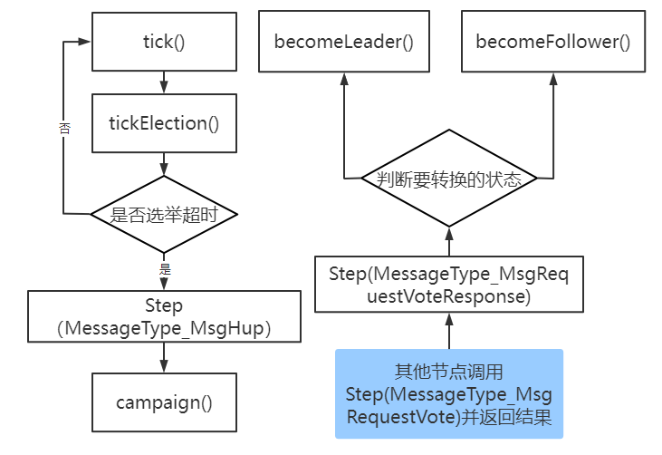
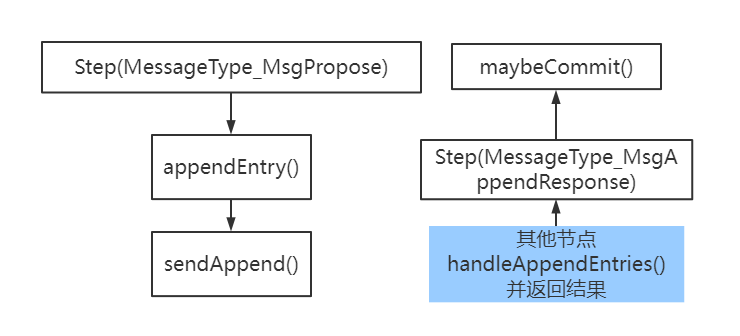

# Lab6 Raft算法实现

## 前言

本项目是根据`2021 vldb summber school`的实验代码改动而成，结合了PingCAP公司的 [tinykv](https://) 和 [tinysql](https://) 项目，
分别是对 [TiKV]() 和 [TiDB]() 的简单抽象。

首先确保你已经安装了[go](https://golang.org/doc/install) >= 1.13 工具链。你还应该安装了`make`。

然后在`tinykv` 或 `tinysql` 目录下运行 `make` 来检查是否安装成功。

```
cd tinykv
make kv
```

这次`Lab6`的实验只关注`tinykv`中的`Raft`算法的实现，所有代码均在`Lab6_Raft/tinykv/raft/raft.go`文件中。

`Lab6_Raft` 实验分为两部分，包括Leader选举和日志复制，请根据注释提示完成代码填充工作。每个小实验后面都有一个验证测试，你可以根据测试来验证自己的代码是否正确。

最后，你可以尝试部署整个项目，运行简单的命令查看整个数据库的运行情况。

## 1. Leader选举

### 实现
第一部分的注释是 `Lab6：Leader_Election_Step`, 根据注释的步骤，自己查看调用链，整理选举逻辑，将代码补充完整。

这里放上一个简单的`Leader`选举调用过程图。



我们需要从 `tick` 出发，向前推进当前的时间。如果时间满足Leader选举的要求，则节点转变状态发起选举。
若某个节点收到了集群中多数节点的赞成票，则可以转为 `Leader`，选举成功。

### 测试
当你完成这部分代码之后，别忘记运行 `make lab6P1` 来测试你的结果是否正确。

**注意：** 即使当前的测试正确，你的代码也可能存在问题。你可以在下面日志复制lab的实现过程中更改当前代码。


## 2. 日志复制

### 实现

第二部分的注释是 `Lab6：Replication_Step`, 根据注释的步骤，自己查看调用链，整理选举逻辑，将代码补充完整。

日志复制简单的调用过程图如下：



首先，Leader收到来自客户端的复制命令，将命令以日志的形式写入到本地存储中，然后将日志项发送给其他节点。其他节点收到日志项需要进行一致性匹配，
并将日志写入到本地，然后回复Leader。当Leader收到多数节点回复完成的时候，会提交此日志项，并将结果广播给其他节点。

## 测试

当你完成这部分代码之后，别忘记运行 `make lab6P2` 来测试你的结果是否正确。 

至此，你可以运行 `make lab6P1` 再次验证你的实现是否正确。

当你完成了所有代码实现之后，你可以查看这个项目的文档，随意运行任意测试，还可以根据下面的部署，自己搭建分布式数据库。

## 3. 集群部署

### 构建

```
cd tinykv
make kv
```

它建立了 `tinykv-server` 和 `tinyscheduler-server` 的二进制文件到 `bin` 目录。

```
cd tinysql
make server
```
它将 `tinysql-server` 的二进制文件编译到 `bin` 目录下。


### 手动部署

将 `tinyscheduler-server` 、`tinykv-server` 和 `tinysql-server` 的二进制文件放到一个目录中。
在二进制文件目录下，运行以下命令：

```
mkdir -p data
```

```
./tinyscheduler-server
```

```
./tinykv-server -path=data
```

```
./tinysql-server --store=tikv --path="127.0.0.1:2379"
```

### 使用群集命令部署

在本地环境中部署集群

```
# compile the cluster binary
cd tinykv
make deploy-cluster

# deploy the cluster, by default the number of scheduler server is 1 and the number of kv server is 3.
./bin/cluster deploy

# start the deployed cluster
./bin/cluster start

# stop the deployed cluster
./bin/cluster stop

# update the binary, please stop the cluster then do the upgrade
./bin/cluster upgrade

# unsafe destroy the whole cluster
./bin/cluster destroy

```

注意这不是部署一个 `tinysql` 服务器，要部署一个 `tinysql` 服务器, 使用
```
./tinysql-server --store=tikv --path="127.0.0.1:2379"
```

### 运行

```
mysql -u root -h 127.0.0.1 -P 4000
```


## 4. 进阶

本实验仅仅是Raft的简单填充工作，如果想继续挑战，那么欢迎你去以下项目中证明自己：

1. [MIT 6.824](https://pdos.csail.mit.edu/6.824/schedule.html)
2. [PingCAP TinyKV](https://github.com/tidb-incubator/tinykv)